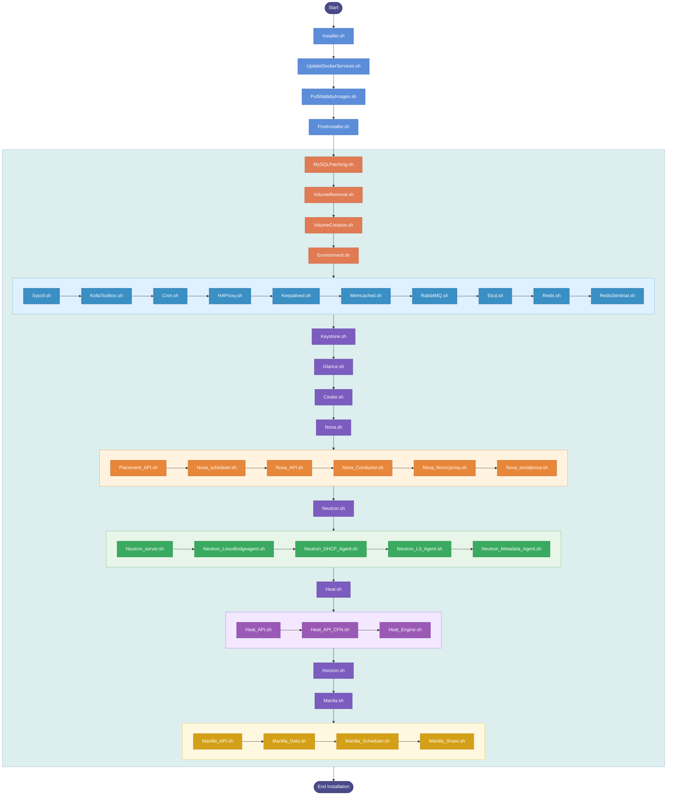

```mermaid
flowchart TD
    Start([Start]) --> Installer.sh
    Installer.sh --> UpdateDockerServices.sh
    UpdateDockerServices.sh --> PullWallabyImages.sh
    PullWallabyImages.sh --> PostInstaller.sh
    PostInstaller.sh --> MySQLPatching.sh

    subgraph post_group [ ]
        direction TB
        MySQLPatching.sh --> VolumeRemoval.sh
        VolumeRemoval.sh --> VolumeCreation.sh
        VolumeCreation.sh --> Environment.sh

        Environment.sh --> infra_group

        subgraph infra_group [ ]
            direction LR
            Sysctl.sh --> KollaToolbox.sh --> Cron.sh --> HAProxy.sh --> Keepalived.sh --> Memcached.sh --> RabbitMQ.sh --> Etcd.sh --> Redis.sh --> RedisSentinal.sh
        end

        infra_group --> Keystone.sh
        Keystone.sh --> Glance.sh
        Glance.sh --> Cinder.sh
        Cinder.sh --> Nova.sh

        Nova.sh --> nova_group

        subgraph nova_group [ ]
            direction LR
            Placement_API.sh --> Nova_scheduler.sh --> Nova_API.sh --> Nova_Conductor.sh --> Nova_Novncproxy.sh --> Nova_serialproxy.sh
        end

        nova_group --> Neutron.sh

        Neutron.sh --> neutron_group

        subgraph neutron_group [ ]
            direction LR
            Neutron_server.sh --> Neutron_LinuxBridgeagent.sh --> Neutron_DHCP_Agent.sh --> Neutron_L3_Agent.sh --> Neutron_Metadata_Agent.sh
        end

        neutron_group --> Heat.sh

        Heat.sh --> heat_group

        subgraph heat_group [ ]
            direction LR
            Heat_API.sh --> Heat_API_CFN.sh --> Heat_Engine.sh
        end

        heat_group --> Horizon.sh
        Horizon.sh --> Manila.sh

        Manila.sh --> manila_group

        subgraph manila_group [ ]
            direction LR
            Manilla_API.sh --> Manilla_Data.sh --> Manilla_Scheduler.sh --> Manilla_Share.sh
        end
    end

    post_group --> EndInstallation([End Installation])

    %% Outer flow nodes
    style Start fill:#4a4a8a,stroke:#2d2d6b,color:#ffffff
    style EndInstallation fill:#4a4a8a,stroke:#2d2d6b,color:#ffffff
    style Installer.sh fill:#5b8dd9,stroke:#3a6abf,color:#ffffff
    style UpdateDockerServices.sh fill:#5b8dd9,stroke:#3a6abf,color:#ffffff
    style PullWallabyImages.sh fill:#5b8dd9,stroke:#3a6abf,color:#ffffff
    style PostInstaller.sh fill:#5b8dd9,stroke:#3a6abf,color:#ffffff

    %% PostInstaller box
    style post_group fill:#dceeee,stroke:#aabbdd,color:#000000

    %% Initial
    style MySQLPatching.sh fill:#e07b54,stroke:#c05a33,color:#ffffff
    style VolumeRemoval.sh fill:#e07b54,stroke:#c05a33,color:#ffffff
    style VolumeCreation.sh fill:#e07b54,stroke:#c05a33,color:#ffffff
    style Environment.sh fill:#e07b54,stroke:#c05a33,color:#ffffff

    %% Environments Grp
    style infra_group fill:#dff0ff,stroke:#88bbdd,color:#000000
    style Sysctl.sh fill:#3a8fc4,stroke:#2a6fa4,color:#ffffff
    style KollaToolbox.sh fill:#3a8fc4,stroke:#2a6fa4,color:#ffffff
    style Cron.sh fill:#3a8fc4,stroke:#2a6fa4,color:#ffffff
    style HAProxy.sh fill:#3a8fc4,stroke:#2a6fa4,color:#ffffff
    style Keepalived.sh fill:#3a8fc4,stroke:#2a6fa4,color:#ffffff
    style Memcached.sh fill:#3a8fc4,stroke:#2a6fa4,color:#ffffff
    style RabbitMQ.sh fill:#3a8fc4,stroke:#2a6fa4,color:#ffffff
    style Etcd.sh fill:#3a8fc4,stroke:#2a6fa4,color:#ffffff
    style Redis.sh fill:#3a8fc4,stroke:#2a6fa4,color:#ffffff
    style RedisSentinal.sh fill:#3a8fc4,stroke:#2a6fa4,color:#ffffff

    %% Keystone, Glance, Cinder, Nova, Neutron, Heat, Horizon, Manila main nodes
    style Keystone.sh fill:#7c5cbf,stroke:#5a3a9f,color:#ffffff
    style Glance.sh fill:#7c5cbf,stroke:#5a3a9f,color:#ffffff
    style Cinder.sh fill:#7c5cbf,stroke:#5a3a9f,color:#ffffff
    style Nova.sh fill:#7c5cbf,stroke:#5a3a9f,color:#ffffff
    style Neutron.sh fill:#7c5cbf,stroke:#5a3a9f,color:#ffffff
    style Heat.sh fill:#7c5cbf,stroke:#5a3a9f,color:#ffffff
    style Horizon.sh fill:#7c5cbf,stroke:#5a3a9f,color:#ffffff
    style Manila.sh fill:#7c5cbf,stroke:#5a3a9f,color:#ffffff

    %% Nova group
    style nova_group fill:#fff3e0,stroke:#f0a050,color:#000000
    style Placement_API.sh fill:#e8873a,stroke:#c06020,color:#ffffff
    style Nova_scheduler.sh fill:#e8873a,stroke:#c06020,color:#ffffff
    style Nova_API.sh fill:#e8873a,stroke:#c06020,color:#ffffff
    style Nova_Conductor.sh fill:#e8873a,stroke:#c06020,color:#ffffff
    style Nova_Novncproxy.sh fill:#e8873a,stroke:#c06020,color:#ffffff
    style Nova_serialproxy.sh fill:#e8873a,stroke:#c06020,color:#ffffff

    %% Neutron group
    style neutron_group fill:#e8f5e9,stroke:#80c080,color:#000000
    style Neutron_server.sh fill:#3aaa60,stroke:#1a8a40,color:#ffffff
    style Neutron_LinuxBridgeagent.sh fill:#3aaa60,stroke:#1a8a40,color:#ffffff
    style Neutron_DHCP_Agent.sh fill:#3aaa60,stroke:#1a8a40,color:#ffffff
    style Neutron_L3_Agent.sh fill:#3aaa60,stroke:#1a8a40,color:#ffffff
    style Neutron_Metadata_Agent.sh fill:#3aaa60,stroke:#1a8a40,color:#ffffff

    %% Heat group
    style heat_group fill:#f3e8ff,stroke:#b080e0,color:#000000
    style Heat_API.sh fill:#9b59b6,stroke:#7a3a9a,color:#ffffff
    style Heat_API_CFN.sh fill:#9b59b6,stroke:#7a3a9a,color:#ffffff
    style Heat_Engine.sh fill:#9b59b6,stroke:#7a3a9a,color:#ffffff

    %% Manila group
    style manila_group fill:#fff8e1,stroke:#f0cc60,color:#000000
    style Manilla_API.sh fill:#d4a017,stroke:#b08000,color:#ffffff
    style Manilla_Data.sh fill:#d4a017,stroke:#b08000,color:#ffffff
    style Manilla_Scheduler.sh fill:#d4a017,stroke:#b08000,color:#ffffff
    style Manilla_Share.sh fill:#d4a017,stroke:#b08000,color:#ffffff
```
