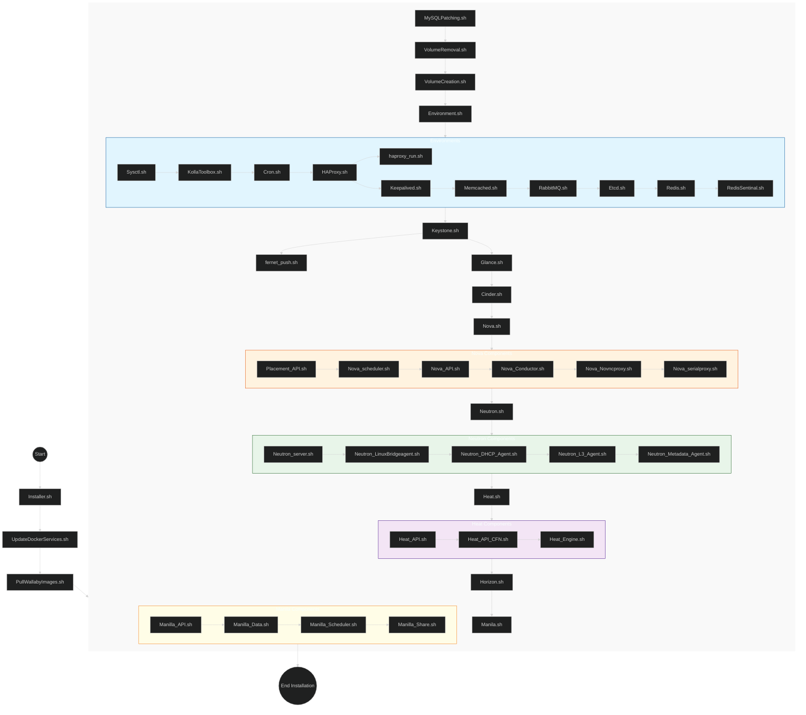

```mermaid
---
config:
  theme: dark
  layout: fixed
---
flowchart TB
 subgraph Environment_Flow["Environments"]
        E2["KollaToolbox.sh"]
        E1["Sysctl.sh"]
        E3["Cron.sh"]
        E4["HAProxy.sh"]
        E4_Sub["haproxy_run.sh"]
        E5["Keepalived.sh"]
        E6["Memcached.sh"]
        E7["RabbitMQ.sh"]
        E8["Etcd.sh"]
        E9["Redis.sh"]
        E10["RedisSentinal.sh"]
  end
 subgraph Nova_Flow["Nova Components"]
        N2["Nova_scheduler.sh"]
        N1["Placement_API.sh"]
        N3["Nova_API.sh"]
        N4["Nova_Conductor.sh"]
        N5["Nova_Novncproxy.sh"]
        N6["Nova_serialproxy.sh"]
  end
 subgraph Neutron_Flow["Neutron Components"]
        NU2["Neutron_LinuxBridgeagent.sh"]
        NU1["Neutron_server.sh"]
        NU3["Neutron_DHCP_Agent.sh"]
        NU4["Neutron_L3_Agent.sh"]
        NU5["Neutron_Metadata_Agent.sh"]
  end
 subgraph Heat_Flow["Heat Components"]
        H2["Heat_API_CFN.sh"]
        H1["Heat_API.sh"]
        H3["Heat_Engine.sh"]
  end
 subgraph Manila_Flow["Manila Components"]
        M2["Manilla_Data.sh"]
        M1["Manilla_API.sh"]
        M3["Manilla_Scheduler.sh"]
        M4["Manilla_Share.sh"]
  end
 subgraph PostInstaller["<br>"]
    direction TB
        PI2["VolumeRemoval.sh"]
        PI1["MySQLPatching.sh"]
        PI3["VolumeCreation.sh"]
        Env["Environment.sh"]
        Environment_Flow
        Key["Keystone.sh"]
        Key_Sub["fernet_push.sh"]
        Glance["Glance.sh"]
        Cinder["Cinder.sh"]
        Nova["Nova.sh"]
        Nova_Flow
        Neutron["Neutron.sh"]
        Neutron_Flow
        Heat["Heat.sh"]
        Heat_Flow
        Horizon["Horizon.sh"]
        Manila["Manila.sh"]
        Manila_Flow
  end
    Start(("Start")) --> Installer["Installer.sh"]
    Installer --> UpdateDocker["UpdateDockerServices.sh"]
    UpdateDocker --> PullImages["PullWallabyImages.sh"]
    PullImages --> PostInstaller
    PI1 --> PI2
    PI2 --> PI3
    PI3 --> Env
    E1 --> E2
    E2 --> E3
    E3 --> E4
    E4 --> E4_Sub & E5
    E5 --> E6
    E6 --> E7
    E7 --> E8
    E8 --> E9
    E9 --> E10
    Env --> Environment_Flow
    Environment_Flow --> Key
    Key --> Key_Sub & Glance
    Glance --> Cinder
    Cinder --> Nova
    N1 --> N2
    N2 --> N3
    N3 --> N4
    N4 --> N5
    N5 --> N6
    Nova --> Nova_Flow
    Nova_Flow --> Neutron
    NU1 --> NU2
    NU2 --> NU3
    NU3 --> NU4
    NU4 --> NU5
    Neutron --> Neutron_Flow
    Neutron_Flow --> Heat
    H1 --> H2
    H2 --> H3
    Heat --> Heat_Flow
    Heat_Flow --> Horizon
    Horizon --> Manila
    M1 --> M2
    M2 --> M3
    M3 --> M4
    Manila_Flow --> End(("End Installation"))

    style Environment_Flow fill:#e1f5fe,stroke:#01579b
    style Nova_Flow fill:#fff3e0,stroke:#e65100
    style Neutron_Flow fill:#e8f5e9,stroke:#1b5e20
    style Heat_Flow fill:#f3e5f5,stroke:#4a148c
    style Manila_Flow fill:#fffde7,stroke:#f57f17
    style PostInstaller fill:#f9f9f9,stroke:none,stroke-width:2px
```
